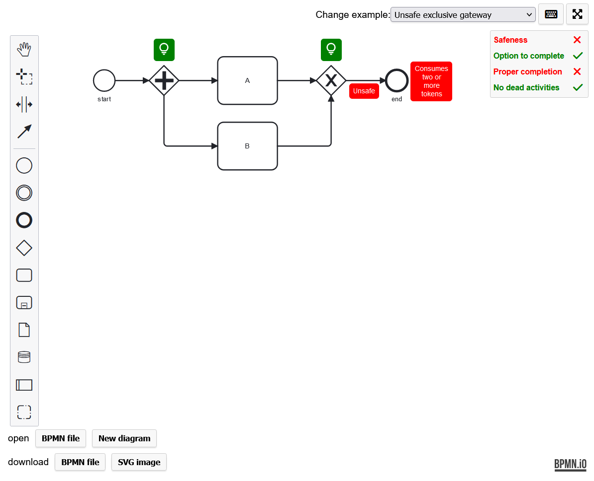
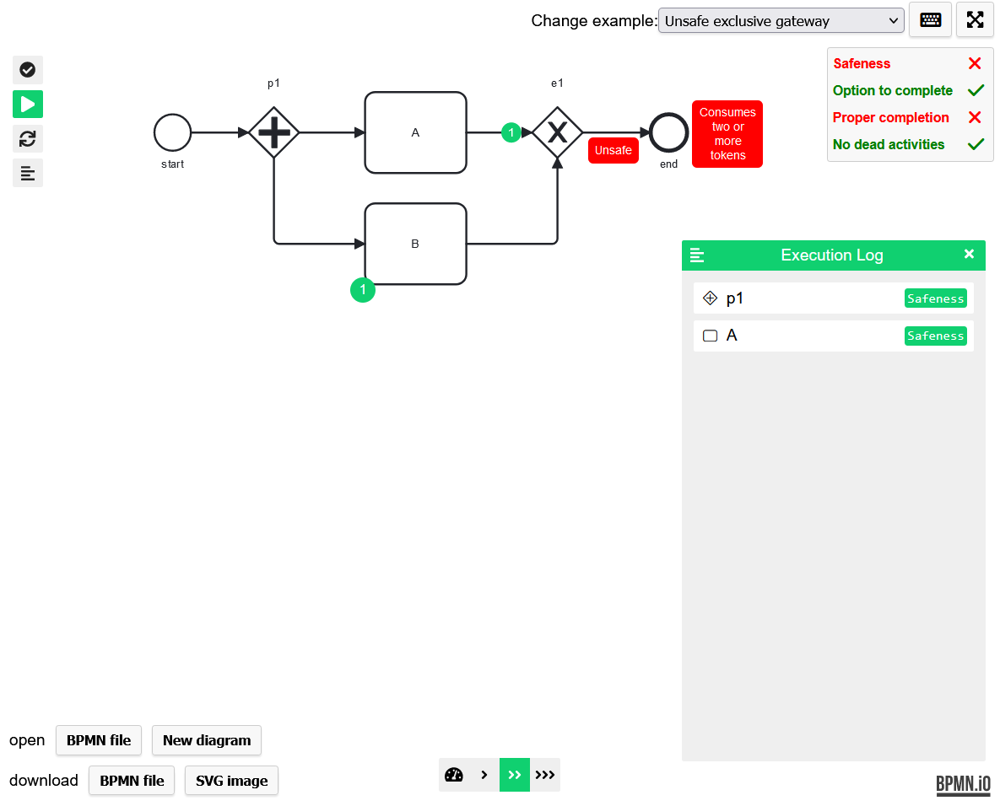

# BPM-2024

This repository contains the artifacts for the paper [_**Instantaneous, Comprehensible, and Fixable Soundness Checking of Realistic BPMN Models**_](./paper.pdf) submitted to BPM-2024.

Our tool is available [online](https://bpm-2024.whitefield-c9fed487.northeurope.azurecontainerapps.io/) and as an artifact (see the implementation section below).

We will archive this repository using Zenodo for the final version of the paper.

## Instantaneous Soundness Checking

The models used in the paper are available in the `artifacts/instantaneous` directory:
1. [model-size](./artifacts/instantaneous/model-size/README.md) contains the BPMN models with increasing model size.
2. [parallel-branches](./artifacts/instantaneous/parallel-branches/README.md) contains the BPMN models with growing parallel branches and branch length.
3. [realistic-models](./artifacts/instantaneous/realistic-models/README.md) contains the realistic BPMN models.

In addition, each directory contains instructions on how to run the soundness checking benchmarks reported in the paper.

### Benchmark environment
- The benchmarks were run with hyperfine version **1.18.0** (binaries available for windows/linux in the **artifacts** folder).
- The benchmarks were run on Ubuntu 22.04.4 with an AMD Ryzen 7700X processor with 32 GB DDR5-5600 RAM on NVMe SSD storage.
- The benchmarks were run with our bpmn-analyzer tool version **0.2.0** (binaries available for windows/linux in the **artifacts** folder).

## Fixable Soundness Checking
The demo application showcasing the quick fixes is available [online](https://bpm-2024.whitefield-c9fed487.northeurope.azurecontainerapps.io/) or locally in [artifacts/tool-with-ui/](./artifacts/tool-with-ui/README.md).

## Implementation
The tool is available [online](https://bpm-2024.whitefield-c9fed487.northeurope.azurecontainerapps.io/).

In addition, the tool binaries are located in
1. [artifacts/](./artifacts/README.md) (for the CLI application)
2. [artifacts/tool-with-ui/](./artifacts/tool-with-ui/README.md) (tool including the UI as shown in the paper and screenshots below)

#### Screenshot during modeling:

#### Screenshot of counterexample visualization:

### Source code
We will make the source code available after the paper is reviewed since it is distributed between different repositories, which might compromise the double-blind review process.
If reviewers want access to the code before, we can anonymize the repositories on demand.

1. Analysis tool written in **Rust**: [TBD](https://github.com/)
2. Front-end implemented using the [bpmn-js](https://github.com/bpmn-io/bpmn-js) ecosystem, especially [bpmn-js-token-simulation](https://github.com/bpmn-io/bpmn-js-token-simulation): [TBD](https://github.com/)
3. CLI tools to generate the synthetic BPMN models: [TBD](https://github.com/)

## Related work

The following table contains a detailed comparison of our supported BPMN features with related work.
We support the most important BPMN features similar to [2] but not as many as [1].
However, support can be extended step by step in the future, and we already support the most popular features.

| Feature                                     | Kräuter [1] | Corradini [2] | Houhou [3] | This work |
|---------------------------------------------|-------------|---------------|------------|-----------|
|                                             |             |               |            |           |
| _Instantiation and termination_             |             |               |            |           |
| Start event instantiation                   | X           | X             | X          | X         |
| Exclusive event-based gateway instantiation | X           |               |            |           |
| Parallel event-based gateway instantiation  |             |               |            |           |
| Receive task instantiation                  | X           |               |            | X         |
| Normal process completion                   | X           | X             | X          | X         |
| _Activities_                                |             |               |            |           |
| Activity                                    | X           | X             | X          | X         |
| Subprocess                                  | X           |               | X          |           |
| Ad-hoc subprocesses                         |             |               |            |           |
| Loop activity                               |             |               |            |           |
| Multiple instance activity                  |             |               |            |           |
| _Gateways_                                  |             |               |            |           |
| Parallel gateway                            | X           | X             | X          | X         |
| Exclusive gateway                           | X           | X             | X          | X         |
| Inclusive gateway (split)                   | X           | X             | X          |           |
| Inclusive gateway (merge)                   | X           |               | X          |           |
| Event-based gateway                         | X           | X             | X          | X         |
| Complex gateway                             |             |               |            |           |
| _Events_                                    |             |               |            |           |
| None events                                 | X           | X             | X          | X         |
| Message events                              | X           | X             | X          | X         |
| Timer Events                                |             |               | X          |           |
| Escalation Events                           | X           |               |            |           |
| Error Events                                | X           |               |            |           |
| Cancel Events                               |             |               |            |           |
| Compensation Events                         |             |               |            |           |
| Conditional Events                          |             |               |            |           |
| Link events                                 | X           |               |            | X         |
| Signal Events                               | X           |               |            |           |
| Multiple Events                             |             |               |            |           |
| Terminate events                            | X           | X             | X          | X         |
| Boundary Events                             | X           |               | X          |           |
| Event subprocess                            | X           |               |            |           |

[1]: Kräuter, T., Rutle, A., König, H., Lamo, Y.: A higher-order transformation approach to the formalization
and analysis of BPMN using graph transformation systems (2023). https://doi.org/10.48550/ARXIV.2311.05243

[2]: Corradini, F., Fornari, F., Polini, A., Re, B., Tiezzi, F., Vandin, A.: A formal approach for
the analysis of BPMN collaboration models. Journal of Systems and Software 180, 111007 (Oct
2021). https://doi.org/10.1016/j.jss.2021.111007

[3]: Houhou, S., Baarir, S., Poizat, P., Qu ́einnec, P., Kahloul, L.: A First-Order Logic
verification framework for communication-parametric and time-aware BPMN collaborations. Information
Systems 104, 101765 (Feb 2022). https://doi.org/10.1016/j.is.2021.101765
